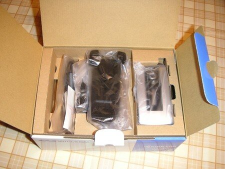

予定通り２５日に到着しました。WX310K。

宅配BOXにWILLCOMロゴの白い箱がとどきました。

早速開封してみましょう。

WX310Kの箱が姿を現しました。

さらに箱をあけるとメッセージが！

**「Have a nice call. いつでも、いつまでも話そう。」**

****

さていよいよ中身がでてきました。

いらっしゃいませ！京ぽん２！

まずは、京ぽんから京ぽん２にデータを移さなければなりません。

とりあえずCD-ROMをパソコンにインストールして、「京セラPHSユーティリティ」でどーんとデータを移しました！同じメーカですからこのあたりは互換性がとれていて楽ですね！

さて、使用記はまた後ほど。
