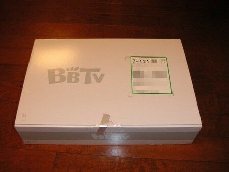

帰ったらBBTVと書かれていた箱が届いていました。どうやらBBTVのセットトップボックスのようです。こんな箱で届きました。

箱の中身はこんな感じです。ICカードが見えます。

この前届いたBBTVのスタータパックに書かれたパスワードなどはこれで使うのですね。しかし、いろいろ送ってくるものですねぇ。  
デジモノ好きの私としては、どこにどうやって配置して、どういう配線をしようかなぁと思いをめぐらすのでしたぁ。
