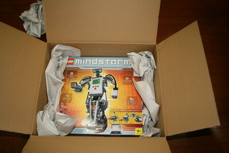
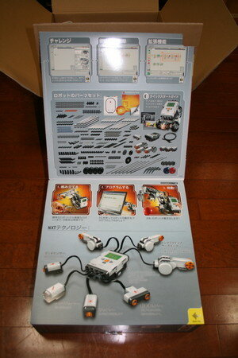
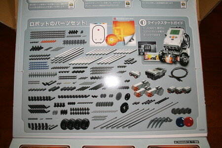
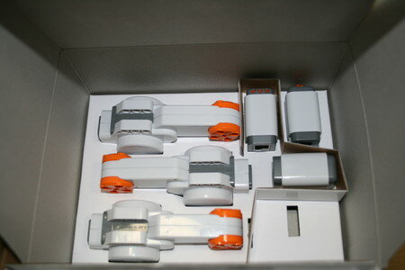

おっきな箱でAmazonからご到着であります。

さっそく開けましょう。

とりだすとこんな感じです。思ったより箱が小さいです。

箱をめくってみると。

これだけのブロックが入っているらしいです。

箱のうらはこんな感じ

さて開けようとおもったら、箱の両端を少し破らないといけません。もったいない。

なんか昔のMINDSTORMSみたいにブロックが整然と並んでいるのではなくて、袋に入ったり、裸のまま入っていたり、見てくれはいまいち。これじゃ整理箱が必要ですねぇ・・

サーボモータとセンサー群はこんな感じ。

CPU本体です。

第一印象としては、やはりロボット作りに特化しているように思えます。

昔のMINDSTORMSのようなモーターではなく、サーボモータなので、タイヤやギヤやプーリーといったものがあまりついていないのが残念です。

商品の箱もマニュアルも昔のMINDSTORMSが良かったですね。NXTのマニュアルはかなり薄くサンプルも１つしか載っていません。CD-ROMやWebサイトを見てくれってことなんでしょうね。

まあ、そんなことを言っていてもしかたないので、何か作ろうかと思ったら電池を買ってくるのを忘れました。単三電池が６本必要でした。明日買ってくることにしましょう。

今日はここまでです。
