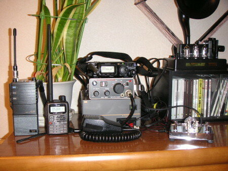

今まではICOMのIC-91Tという50/144/430Mのハンディ機一台だったのですが、FT-817NDを買い込んでしまいました。この大きさでHF~430MHzまでオールモードというのは昔では信じられません。おまけに7MHzのホイップアンテナも買い込みました。

とりあえず、送信機追加ということで、設備変更を関東総合通信局に提出して、新しい免許状の待ち状態です。

待っている間に押し入れで眠っていたミズホのSB-2Mという144M CW/SSBハンディ機やICOMのIC-12Gという1200MHzのハンディも掘り起こして電源を入れてみましたが、一応受信はできるみたいです。新しい免許状がきたらこれらのRIGも追加しようかなと思います。TSSの保証料がかかっちゃいますけど・・・。

あと、BENCHERのパドルもひっぱりだして、FT-817NDにつないでみました。CWの再勉強も良いかもしれません。

