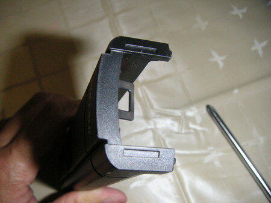
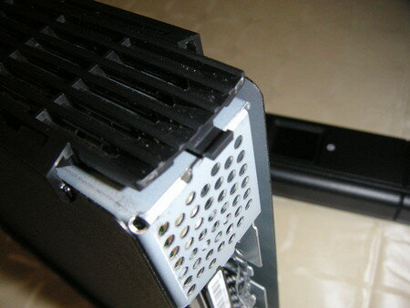
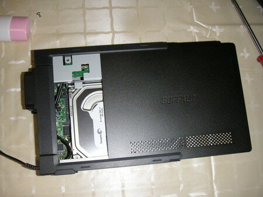
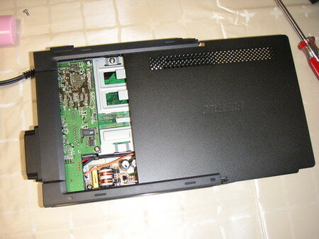
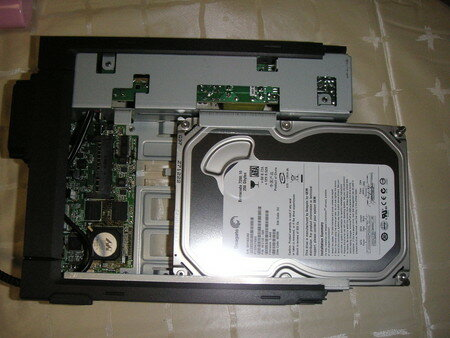
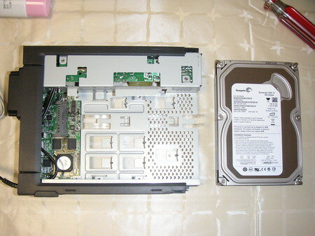

BUFFALO LinkStation LS-H250GLを分解してみました。

## 注意事項

あくまでも参考です。分解は自己責任でお願いします。

## STEP1

LinkStation本体をひっくり返すとネジがあります。これを外します。

## STEP2

写真ぐらいの角度までフロントパネルをゆっくり起こし、そのままの角度で水平に引っぱるとフロントパネルが外れます。

## STEP3

フロントパネルの本体側の爪がひっかかる部分です。下向き斜めになっているのがミソです。

## STEP4

本体の爪の部分です。爪を折らないように慎重に作業しましょう。

## STEP5

サイドパネルをスライドして外します。

## STEP6

反対側も同様に外します。

## STEP7

３本のネジでハードディスクを固定していますので、それを外します。

## STEP8

慎重にハードディスクを外します。

## STEP9

これでハードディスクが外れました。

外したハードディスクを手持ちのPCに接続しDebian化に入ります。

## まとめ

初代KURO-BOXに比べ格段にメンテナンスしやすくなっているのがうれしいです。
