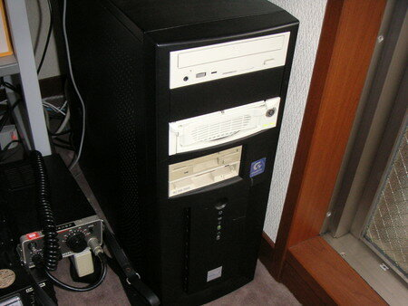
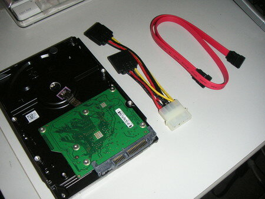
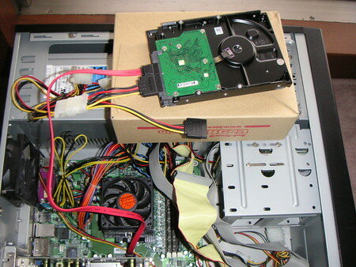

LS-H250GLから外したHDDを実験用PCに接続します。

以降の作業は、山下さんの [LinkStation／玄箱 をハックしよう](http://www.yamasita.jp/linkstation/index.html)を参考にさせていただいております。

もちろん、作業は自己責任でお願いします。

実はS-ATAなるHDDを触るのはこれが初めてだったりします。これまではずっとIDEだけでした・・・。

とりあえず、PCのブートディスクをDebian 4.0がインストールされているものにします。うちのデスクトップPCは実験用なのでブートディスクを簡単に交換できるようにしているのです。

うちのAthlon64デスクトップPCです。

材料はこれだけ。HDDはLinkStationから取り外したもの。ケーブル類はマザーボードの付属品です。

こんな感じでS-ATA HDDを接続しました。

この状態で、PCのブートディスクからDebianを起動します。果たしてS-ATA HDDを無事認識してくれるのか？

キター！！
