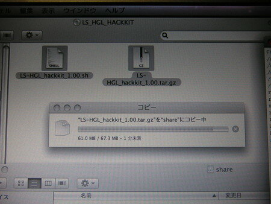
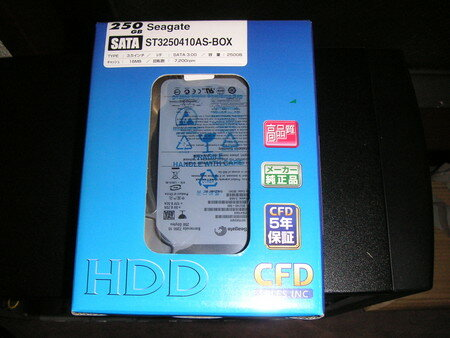
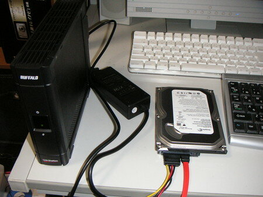
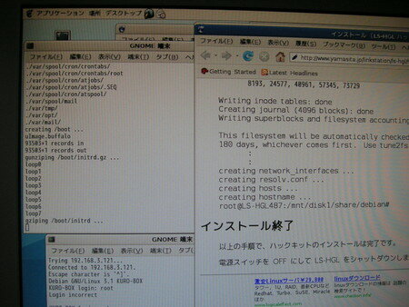
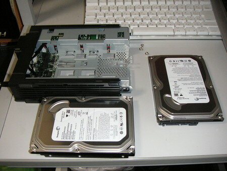

LS-H250GLから外したHDDを実験用PCに接続し、山下さんの[LS-HGL ハックキット](http://www.yamasita.jp/linkstation/ls-hgl/hackkit/)に従ってdebian化を行いました。

手順通り進めれば全く問題ありませんでした。

私の場合は、実験用PCに接続して[アカウントの調整](http://www.yamasita.jp/linkstation/ls-hgl/hackkit/post_2.html)を行う際に、[標準ファームのバックアップ](http://www.yamasita.jp/linkstation/2008/03/080318_post_78.html)もついでに行っておきました。

以下、作業中のスナップ写真。

山下さんに送っていただいたハックキットをLS-HGLのHDDにコピー中。ここはMacで作業しました。

今回作業用に購入したHDDです。Seagate ST3250410AS(250GB)で、標準ファームのHDDと同じメーカー、同じ外寸のものにしました。でもキャッシュは16MBと倍になっています。

LS-HGLにUSB接続した作業用HDD

作業用HDDがsdbで認識しました。

ハックキットのインストール開始！

インストール中の様子

インストール完了しました。おきまりのsync３回。

標準ファームのHDDと作業用HDDを交換します。

作業用HDDに換装が完了したLS-HGL。標準ファームのHDDは箱にしまって保管しておきましょう。

無事ログイン完了です。おつかれさまでした。

