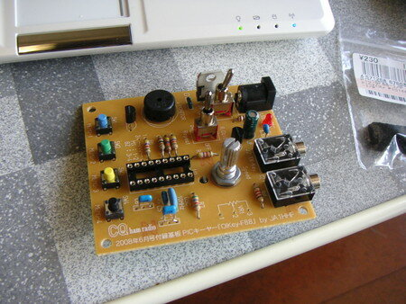

今月号のCQ ham radio誌の付録として基板がついていた４チャネルメモリキーヤーOIKey-F88を作りました。

パーツはPICとかスイッチ、3.5φジャック以外はすべて手持ち部品です。足りないものは土曜日に秋月で買っておきました。

いつものようにEee PCにPICライタをつないでプログラムを書き込み組み立て完了。ただし手持ちの圧電ブザーだと音がかなり小さかったので電子ブザーに交換しました。

とりあえずはKeyerとして動作しているようですが、本格的に使うのはいつのことやら。

PICライタで書き込み中です。

完成したOIKey-F88です。

写真を撮るときにPICとツマミをつけるのを忘れた・・・。
