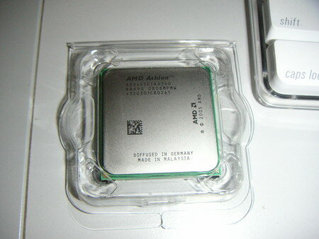
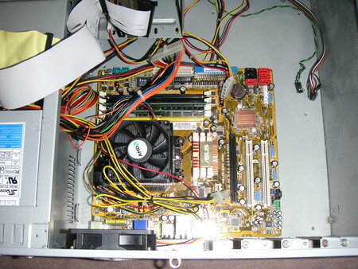

これがいままで使っていたAthlon64 3000+の内部です。マザーボードはATX。最近はPCIスロットもがら空き。

新しいCPU君 Athlon X2 4450e。これからよろしくね。

マザーボードの入れ替え完了。microATXだから小さいですね。

「あれ？」

しまったぁ。[ATX2.2](http://fpc.misumi.co.jp/catalogue/support/html/atxhyo-ka.htm)だった。電源コネクタが合わない・・・・。

電源変換ケーブルは近所のショップにあるかなぁ・・・。また秋葉原？

結局週末までおあずけか。
