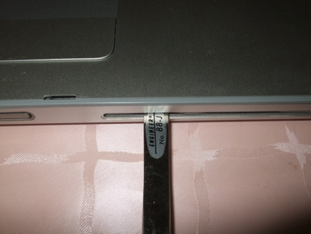
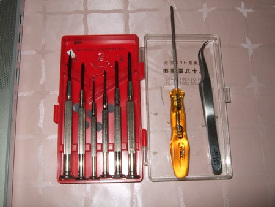

MacBook Proのハードディスク交換作業を行いました。

参考にしたサイトは以下の通り。

- [MacBook Pro 1.83GHz/2.0GHz(2006年1月発表、15インチモデル)](http://mac.ascii24.com/mac/review/portable/2006/03/15/661126-000.html)

- [雑記 - MacBook Pro 15inch の HDD交換](http://ult.riise.hiroshima-u.ac.jp/~nagato/?MacBook+Pro)

これらのページに詳しい手順や写真がでていますので、それを見れば作業内容は把握できます。作業中難易度が高いのは、ツメを外す部分のようです。またネジが多いのもくせ者です。

## ねじの配置を記録する

このような場合は私はネジを外す前に見取り図を書いて、その上に外したネジを載せていくということで管理しています。具体的には以下の写真のようにです。

## ツメを外すのが一苦労

あとは、参考ページにしたがって分解をすすめますが、やはりツメの部分が難問でした。

いろいろ試していたら、バッテリを外した穴から天板の裏を押すと、ツメが１つはずれたのであとは少しずつ力をいれて順番にツメを外していきました。

ツメはこんな感じです。

## フレキシブルケーブルの取り外し

キーボードを接続しているケーブルですが、セロハンテープのようなものでカバーがしてあります、このテープをはずすときに手の油脂が少しテープについてしまいます。あまり基板には良くないんでしょうけど。

## 新しいハードディスクと交換する

右側が外したハードディスクと、左側が今回取り付けるハードディスクです。今回はSeagate ST9320320AS(320GB)を使いました。

分解しているときに気がついたのですが、左右のスピーカーの上にホコリが溜まっていました。マザーボードの上には２つのファンがついていますので、この場所から空気と一緒にホコリを吸っちゃうんでしょうね。

## ケースを元通りに組み立てる

最後にケースを締めるときですが、今度はツメの部分をうまくはめなければなりません。上から押しただけでは、うまくハマらないので、今回はピンセットの柄の部分をつかって動かないように抑えてはめ込みました。

今回使った工具です。精密ドライバーはこの中で１本しか使っていません。あとはT6のトルクスドライバとピンセットです。

## 電源をいれてみる

組み立てなおして電源を入れました。無事正常に起動できています。

当然ハードディスクにはまだ何もないので、このような画面になってしまいます。

引き続きOSのインストールになりますが、続きは次回。

※写真が少し汚かったのでiPhotoで再度アップしました。
