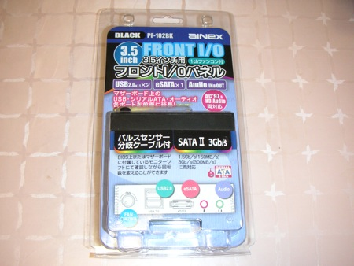
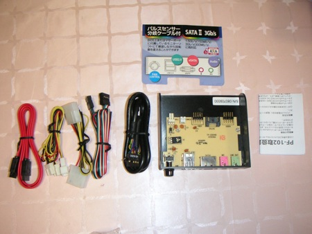

前々からPCにフロントI/Oパネルを取り付けたいと思っていました。USB端子の抜き差しがしにくいためです。近くのPCショップに出かけて手頃なものを買ってきました。

選んだ理由ですが、

- eSATAがあるとハードディスクのコピーに便利。

- 内蔵メモリカードリーダは特に必要ない。（別にUSB接続のものを持っている）

- USBポートが２つあること。

- オーディオ入力端子もほしい。

- 値段が安い。

というところです。

パッケージをあけるとこんな感じです。ケーブル、ネジが一通り揃っています。

さて早速接続を始めます。

結構配線量が多いですね。

ケースに組み込むとこんな感じです。

配線がぐちゃぐちゃなので、バインド線で奇麗にします。

これですっきりしました。動作確認としてUSB端子にパソリを接続してみました。

これでUSB接続が便利になりました。

オーディオも全面に来ましたので使いやすくなりました。
