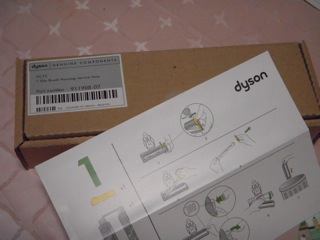

ダイソン(Dyson)と言えば掃除機ですが、吸い込み口の部分が古くなってきたのでオンラインショップで交換用の部品を買ってみました。

[ダイソンのオンラインショップ](http://www.rakuten.co.jp/e-dyson/)は最近楽天に移行したようで今なら送料無料とのこと。

こんな感じで到着しました。翌日到着でとてもスピーディー。

  

付属のマニュアルをみて簡単に交換できました。

よく見るとこれまで使っていたものと少し構造が変わっています。改良され続けてるんですね。
