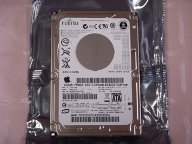
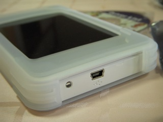
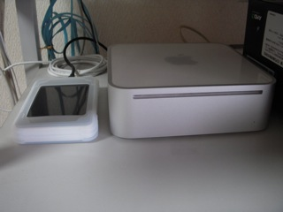

ハードディスクを交換したMacBook Proですが、特に問題もなく快調に稼働しています。

新MacBook Proも発売されたことですし、もう元のハードディスクを取り付けることはないだろうと、SATA用のハードディスクケースを買ってきました。玄人志向2.5インチSATA対応シリコンジャケット付きハードディスクケース [GW2.5SJ-SU2](http://www.kuroutoshikou.com/modules/display/?iid=978) です。

玄蔵の中身はこんな感じでシンプルです。

MacBook Proに内蔵されていた120GB 2.5インチハードディスクです。これを取り付けます。

取り付け完了です。接続コネクタはこんな感じです。

早速、Mac miniにつなぎます。

無事認識できました。

あとは必要なデータをコピーして。タイムマシンのディスクにしましょうか。
