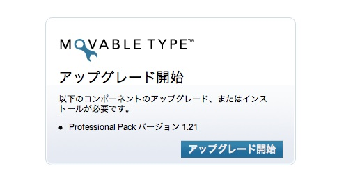
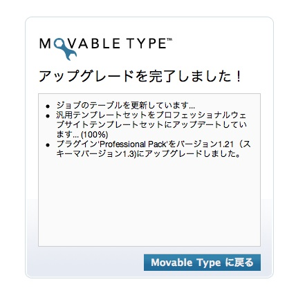
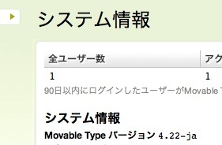

Movable Type 4.22?[セキュリティアップデート](http://www.sixapart.jp/movabletype/news/2008/10/15-1400.html)が公開されていましたので、早速アップデートしてみました。

手順は[ここ](http://www.movabletype.jp/documentation/upgrade/)にありますが、あまり具体的でないので実際の手順をまとめておきます。私の場合は、MacBook Proのターミナルからすべて作業しています。

1. ダッシュボードから「ツール」→「バックアップ」でバックアップを取得。
1. アップデータをダウンロード
1. scpでサーバにコピー
1. サーバにログイン。解凍する。
    ```
    $ cd
    $ unzip MT-4_22-ja.zip
    ```
1. 必要なファイルを現在のディレクトリからコピー
    ```
    $ cd mt
    $ cp mt-config.cgi ~/MT-4.22-ja/.
    $ cd plugins/
    $ cp -rp iMT ~/MT-4.22-ja/plugins/.
    $ cp -rp HatenaAuth/ ~/MT-4.22-ja/plugins/.
    $ cd ../mt-static/plugins/
    $ cp -rp iMT ~/MT-4.22-ja/mt-static/plugins/.
    ```
1. 昔のディレクトリを退避
    ```
    $ mv mt mt.old
    ```
1. 新しいディレクトリに置き換え。
    ```
    $ mv ~/MT-4.22-ja/ mt
    ```
1. ダッシュボードにアクセス。次の画面がでる。
    
1. アップグレード開始ボタンを押す。
    
1. アップグレードされているかシステム情報で確認します。
    
    新バージョンの4.22になっています
1. 古いディレクトリを削除
    ```
    $ rm -rf mt.old
    ```
1. 作業完了
