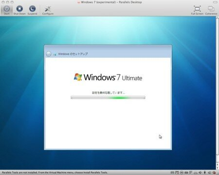

Windows 7 のベータ版の配布が始まったので、早速MacBook ProのParallels DesktopのVMにいれてみました。インストールは問題なく完了したのですが、どうもネットワークがうまく使えません。

このままスタンドアロンで使ってもしかたないので、我が家のVistaマシンのハードディスクを実験用ハードディスクに差し替えて、インストールしてみました。

こちらも何の問題もなくインストールできました。しばらくIE8を使ったりとか、BOINCをインストールしてSETI@homeとか動かしてみました。

そうこうしているうちに、VISTAを使いたいよぉと言われたので、VISTAのハードディスクに差し替えました。

短い時間でしたが、感触としては結構使えそうという感じ。各種アプリケーションの動作はまだ確認していませんので、ぼちぼち使ってみたいと思います。

そうこうしているうちに、Parallels DesktopもWindows 7 betaの対応をするでしょうし。

＜追記＞一度VMをばっさり消して、再インストールしたらネットワークも使えました。

