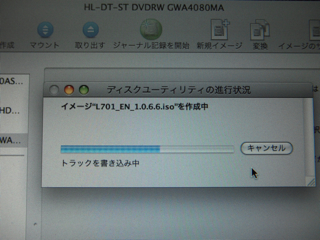

これまで使ってきたモバイルパソコンEeePC 4Gの環境は無事VAIO type Pに移行しました。  
これで、EeePC 4Gの役割が終わってしまったわけですが、せっかくメモリが2GBも積んでいることなので、何か他の用途に使えないかなとうろうろしているとみなさん「Xandros」をインストールして、しかも日本語がつかえるようにしているようです。  
早速私もやってみました。参考にしたサイトはこちらです。写真が豊富につかってあって、わかりやすいですね。  

  
- [オカベのカタリベ](http://www.e-okabe.jp/kataribe/2008/07/eeepc-4gxandros.html)
  

さて、まずはDVDを作成。私の場合はいつもMacBook Proで焼いてます。

そして、この前購入したDVDドライブをEeePCにつないでbootします。

順調にXandrosが起動していきます。

インストールが完了して、再起動すると英語版になります。

このあと、ゴソゴソ作業をすると。

これで日本語版になりました。素晴らしい。

実際に使ってみましたが、Windows XPよりXandrosがはるかに快適という印象。  
やはり、EeePCはこのXandrosありきで開発されたものなのでしょうね。  
こんな小さなマシンで、せっかくLinuxが稼働しているわけですから、いつものようにサーバ化してみますかね。メモリも2GBありますし・・・。
