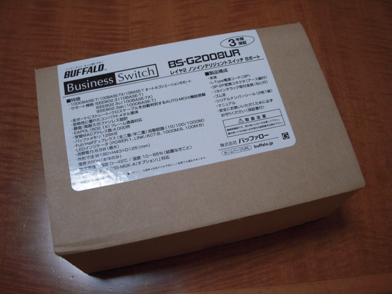

秋葉原を歩いていると、ふと段ボール箱が目に入りました。

どうもバッファローの法人向けの8ポートHUBのようです。中古品でした。型番はBS-G2008URと書かれています。  
目にとまった理由は1000BASE-T対応という文字でした。  
我が家にはMacBook ProやLinkStartionなどすでにGiga LAN対応の製品はいくつもあるのですが、これまでGiga LAN対応のHUBが無いので100BASE-Tで使っていました。  
値段を見ると1,980円。そのままレジに持っていってしまいました。

帰って箱から取り出してみるとかなり奇麗です。新品と言われてもわからない状態です。ラックマウント用の金具までついていました。（今は使いませんが）

早速設置しました。すべてのLANケーブルをこのGiga HUBに集約することができました。LEDもたくさん光ってカッコいいです。

Gigaにしたことで何か変化があるかなぁ・・・。
