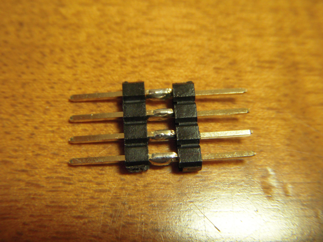

Spyderも手に入ったことですので、[HCS08](http://www.freescale.co.jp/products/8bit/HCS08/index.html)を使って簡単な回路を作ってみました。  
サンプルはエレキジャック No.8の特集です。ターゲットデバイスはエレキジャックの付録でついてきたMC9S08QG8CPBEです。ブレッドボードも付録でついてきましたのでこれを使います。  
単純にLEDを点滅するだけの回路です。私の場合はホストはMacBook ProでParallel Desktopの上のWindows XPを使いました。  
Spyderに付属しているCD-ROMから開発環境のCodeWarriorをWindows XPにインストールしたあとに、デモプログラムをターゲットデバイス用に書き換えます。回路はブレッドボードで組みました。こんな感じ。簡単すぎですが。

ホストコンピュータとはコネクターを使ってUSB接続をします。

エレキジャックの記事では、EZコネクタなるものを作ってブレッドボードに接続するとありますが、私の場合、ブレッドボードから何度もコネクタが抜けてしまったので、ブレッドボード側もある程度の長さが取れるようにこんな感じのヘッダピンを作って安定させました。

MacBook ProのWindows XPでCodeWarriorを使ってコンパイルしたものをターゲットに送信します。写真だけでは動いているのがわからないので、動画もアップしました。

&amp;amp;amp;amp;amp;amp;lt;a href="http://www.nicovideo.jp/watch/sm6246510"&amp;amp;amp;amp;amp;amp;gt;【ニコニコ動画】HCS08でLEDを点滅させて遊ぶ&amp;amp;amp;amp;amp;amp;lt;/a&amp;amp;amp;amp;amp;amp;gt;

とりあえず動いていますね。プログラムの定数をいじると点滅速度を変えることができます。でも、さすがにこれだけでは物足りないなぁ。
