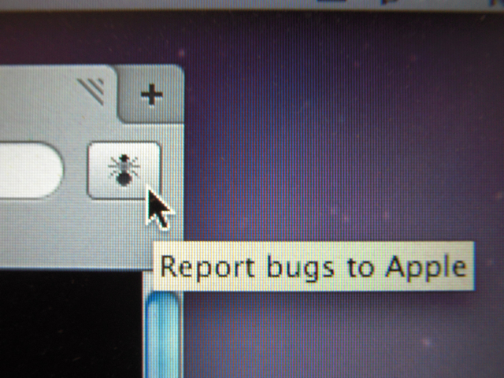

Safari 4 のパブリックベータが公開されましたので、早速MacBook Proにインストールしてみました。  
速度的にはちょっぴり速くなり、JavaScriptを多用しているページは反応が良くなったなぁという感じ。英語メニューは気になりますが、他はSafari 3を使っている感覚で違和感なく使えます。ブックマークもそのまま引き継がれます。  
特に気になったのは、右上にある虫のアイコン。正式版では見られないと思うのでぜひインストールをお試しあれ。

