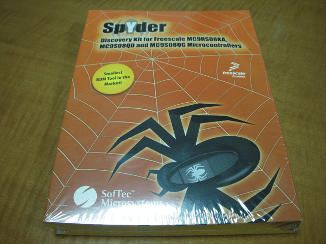

少し前に買っていたエレキジャックNo.8を眺めていたら、HCS08というマイコンに興味があったので、Spyderという開発ツールを買ってきました。  
お値段は4000円程度。こんな値段で開発ツール一式が揃うなんて良い世の中になったものです。  
パッケージはこのような感じ。

中身を開くとCD-ROMが１枚とUSBに接続するツールが１つ。

USBに接続するコネクタです。

さて、まずはエレキジャックのサンプルを組んでみましょうか。
