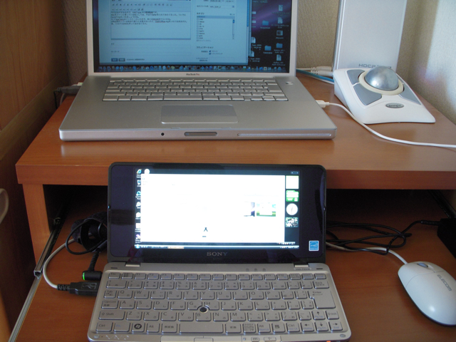

今日はおやすみなので、VAIO type Pの環境整備です。  
Macをメインに使っている私としては、やはりSafariを入れて、ついでにQuickTimeもいれましょうかね。  
もうTeraTermはインストールしたので、あとはWinSCPぐらいかな。  
Office系のソフトはあまり使うとは思えないけど、OpenOffice.orgをいれておきますか。  
あ、リカバリDVDも作っておかなくちゃ。

