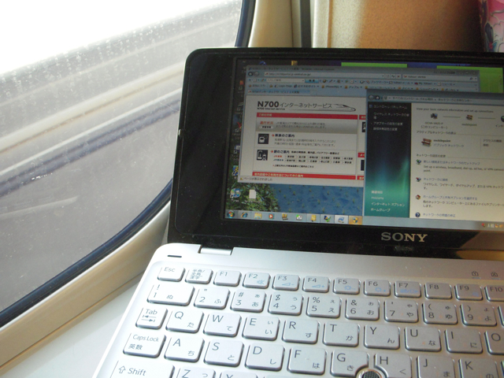
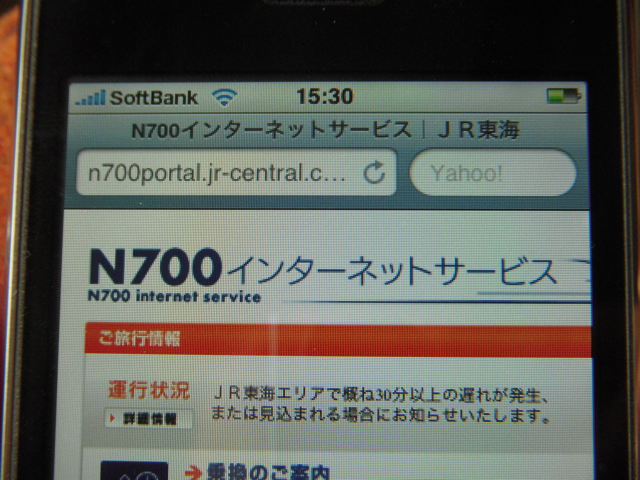

新幹線にのる機会がありましたので、VAIO type Pを持ち込み、N700系で提供されているインターネットサービス（無線LAN）を使ってみました。  
早速VAIO type Pの電源を入れると、こんなに沢山のSSIDが表示されます。

早速自分のプロバイダで接続。無事インターネットに接続できました。

結構安定しています。ちなみにWindows7のベータ版です。

もちろん、iPhoneでもつかえますぞ。

足下に電源コンセントも装備されているので怖いものなしですね。
