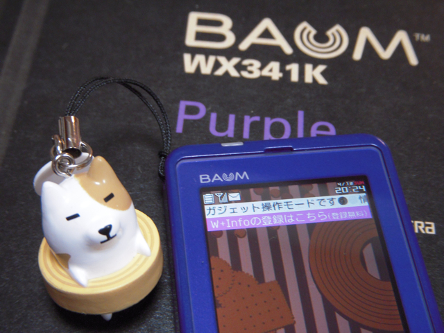

iPhone登場以降使う機会が無くなっていたウィルコムのスマートフォンAdvanced/W-ZERO3\[es\]を思い切って、最近登場したBAUMに機種変更してしまいました。  
この機種が気になっていた理由は、

1. おサイフケータイである。
2. 薄くてかっこいい。
3. キャラが好き。

という３点です。  
でも、なぜウィルコムを使い続けるのかという理由は、実家に帰ったときや旅行先のPCの通信手段（モデムとして）として必要だからなのです。

しかし、このおまけのストラップのキャラは良い。  
あと、アドエスは我が家の無線LANにつながってメールビューアとして活躍中。
