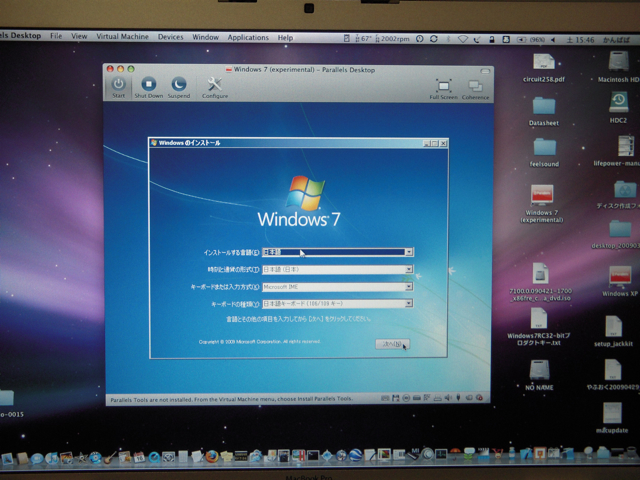

MacのParallels Desktop(Build 4.0.3844 Tue, 05 May 2009)でWindows 7 RCを動かしてみました。  
全く問題なくインストールでき、これまた非常に快適です。  
これまでParallels DesktopではWindows XPを使っていましたが、今後Windows 7の環境に移行してみたいと思います。

気になるWIndows エクスペリエンスの数値は以下の通りでした。マシンはMacBook Pro (2.16GHz Core2 Duo, 4GB RAM)です。

- プロセッサ　4.3
- メモリ 4.5
- グラフィックス 1.9
- ゲーム用グラフィックス 1.0
- プライマリハードディスク　5.9

ビデオ関連の数値はあまり良くないですが、特に操作上で支障はないように思います。
