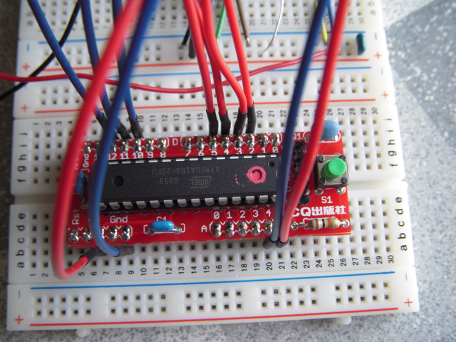
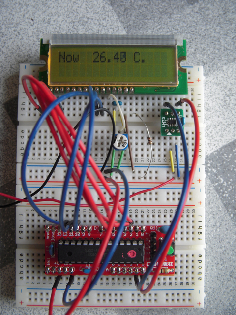

Arduino互換のeJackino miniを組み立てました。部品数も少ないのですぐ完成しました。

ATmega168はeJackinoで動いているものを抜いて、そのままeJackino miniに差しました。  
eJackinoではLCD温度計が動いていましたが、そのスケッチを書いたマイコンをそのまま使いましたので、eJackino miniで同じ回路を組んでみました。

すべてブレッドボードに収まるので思った以上に使いやすかったです。電源は秋月の5V電源アダプタをつなぎました。
