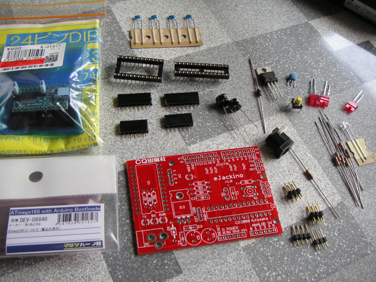
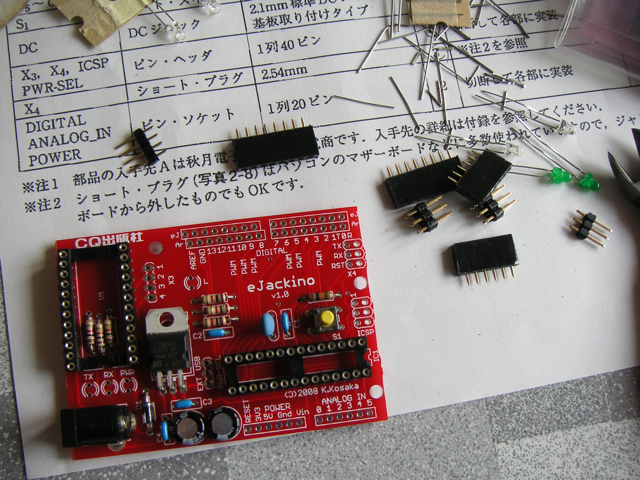
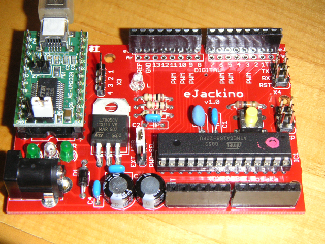

当選したeJackino基板を組み立てるべく、足りないパーツを買いに秋葉原にいってきました。ほとんどのパーツは揃ったのですが肝心のAVRマイコン(ATMega168-20PU)が品切れで見つかりません。困っていたところにマルツパーツ館で[Arduinoのブートローダが書かれたATMega168](http://www.marutsu.co.jp/user/shohin.php?p=64285)が一つだけ残っていて、やや高かったのですが、しかたなくそれを買ってしまいました。（本当はブートローダの書き込みもやってみたかったけど）

揃ったパーツを並べてみました。LEDは手持ちのものが沢山あったので、どれにしようか悩んでしまいました。

組み立て自体は特に問題なかったのですが、LEDの極性が基板に印刷されていなかったので、十分確認しながら取り付けなければなりません。A/Kとか書いてあると安心ですね。

あとは、ピンソケットが曲がってしまいそうだったので、ピンヘッダをつけて手持ちのユニバーサル基板に差し込んだ状態でハンダ付けをしました。

完成したeJackinoです。

早速、MacのUSBハブに接続したところ、LEDがちかちか点滅し始めました。問題なく動作しているようです。  
次にLEDを点滅させるスケッチをアップロードしたところ、なぜかうまくアップロードできません。アップロード中にTXのランプはちかちか点滅するですが、RXのランプが全く点滅しません。ATMega168からの応答がきていないように見えます。いろいろ調べてみたら、X4ジャンパーをショートするのをすっかり忘れていました。これではマイコンと通信ができるわけがありません。ジャンパーをショートしたところ正常にアップロードできました。

あとは手持ちのLCDを接続してみました。プログラムはスケッチのサンプルがありましたので、そのソースに書かれたピン配置で接続しました。

無事問題なく表示されました。この[秋月のLCDモジュール](http://akizukidenshi.com/catalog/g/gP-01797/)はLEDバックライトで小さくて使いやすくておすすめです。
