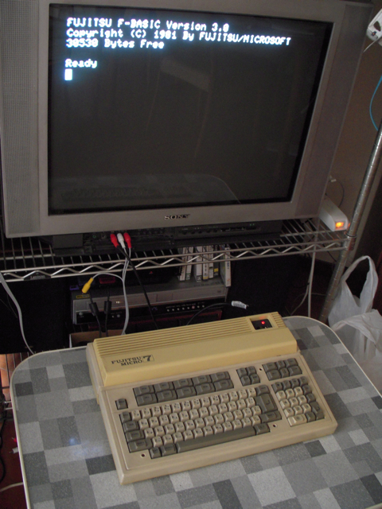

ひょんなことからFUJITSU FM-7が手に入ったので、テレビに接続してみました。  
FM-7はモノクロ出力がありますので、それをビデオ入力に接続すれば普通のテレビで表示することができます。DIN5Pのコネクタとビデオケーブルをはんだ付けすれば準備完了です。

30年ぶりでしょうか。F-BASICのスタートアップ画面をみることができました。  
さすがにF-BASICのコマンドは覚えていませんが、基本的なBASICのステートメントは実行できました。  
実家に帰ればたぶんFM-7の資料が残っていると思うので、夏休みに掘り出してみたいと思います。
