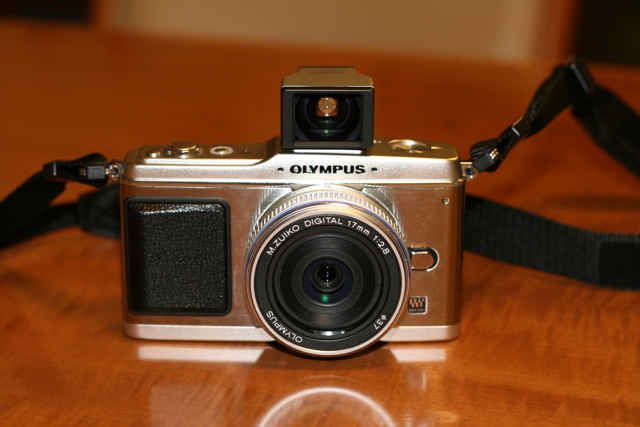

最近TV CMが良く流れますが、オリンパスのマイクロ一眼 [OLYMPUS PEN E-P1](mailto:http://olympus-imaging.jp/product/dslr/ep1/index.html)を買ってしまいました。これまでは、キャノンのEOS Kiss digital Xを使ってきましたが、やはりその大きさ重さからイベント（運動会とか学芸会とか）のあるときにしか使わなくなってしまいました。  
もっと気軽に持ち運べる一眼があればいいなあと思っていたところに、このPEN E-P1の登場です。実は私が小さいときに両親が使っていたカメラがオリンパスペンEEだと思います。だからだと思いますが、新しいのですが、懐かしい感じがします。この大きさと重さであれば気軽に持ち歩けますし、最近のコンパクトデジカメにある多種多様なシーン選択やアートフィルタ機能、HDビデオの撮影等と最新鋭の機能を持っています。  
撮影した写真で出来のいいものを、オリンパスの写真コミュニティ[FotoPus](http://fotopus.com/index.html/module/MyFotoPus/action/MyFotoPusDetail/mem_cd/2009072800000356269/)に投稿しました。右側にあるブログパーツからもリンクしてます。  
今回はパンケーキセットにしたのでズームレンズ等は無いのですが、そのうち欲しいなと思っています。

