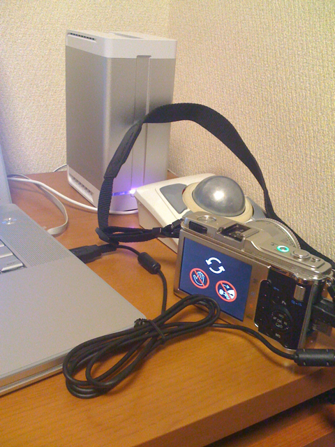

連休前にやっておけば良かったのですが、ようやくOLYMPUS PENのファームウェア更新を行いました。E-P1本体、M.ZUIKO DIGITAL ED 14-42mm F3.5-5.6、M.ZUIKO DIGITAL 17mm F2.8 の３つのアップデートを行いました。いささかAFの動きが良くなったように思いますが、今週末にまたいろいろ撮ってみます。 ファームウェア更新中のPEN (iPhoneで撮影） 
