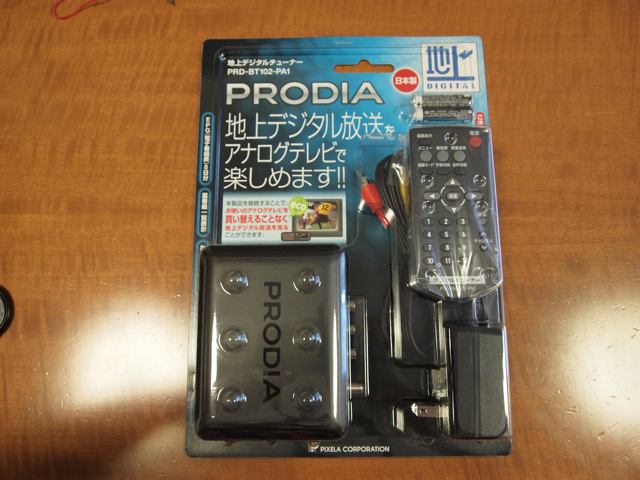
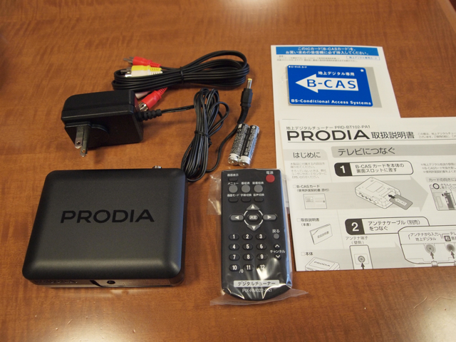

今日、イオンで発売したピクセラ製の地上デジタルチューナーPRODIA (PRD-BT102-PA1)を早速買ってきました。確か価格は4980円と聞いていたのですが、今日は4750円で売っていました。  
最低限の機能しかありませんが、十分に使えるものでした。  
パッケージはこんな感じです。

中身はこんな感じです。B-CASカードやケーブル類も一通り揃っています。

  

アナログテレビへの取り付けはすぐ完了しました。電源を入れて、決定ボタンを押すだけで初期設定が開始され、受信できたチャンネルを自動登録してくれます。

  

今回取り付けたテレビは14インチで画面が小さいのですが、初期設定の画面の文字や  
番組表などの文字も問題なく読むことができました。  
これでアナログテレビはまだまだ活用できそうです。
