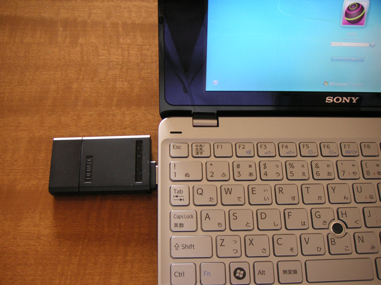

Windows7 RCをインストールしたVAIO type PでウィルコムのUSB-WSIMを使ってみました。USB-WSIMとは、WILLCOM SIM STYLEの１つで、USB接続のW-SIM用アダプタになります

写真を見ればわかりますが、USBコネクタの保護ケースを、W-SIM側に取り付けることで、W-SIMの保護ケースとなります。USBコネクタの保護はどうするのという話もありますが、そのあたりは特に気になりません。

付属のCD-ROMのインストーラでは、未対応のOSということでインストールできないのですが、サブディレクトリにあるインストーラを個別に実行することで、Windows7 RCでもインストールが可能です。  
まずは、CD-ROMにあるVistaディレクトリの中のDPinst.exeを実行。これでデバイスドライバが組み込まれます。次にModemディレクトリのDPinst.exeを実行。これでモデムドライバが組み込まれます。あとは、ダイヤルアップネットワークの設定を行えば完了です。  
私の場合は、プロパイダはYahoo!BBなので、モバイル接続（おでかけアクセス）に加入しました。月額210円ですが、A&B割を適用するとWILLCOMの基本料金が若干安くなりますのでお得です。  
これで、無線LANが無い環境でもモバイル接続ができるようになりました。出先で役に立つと思います。

