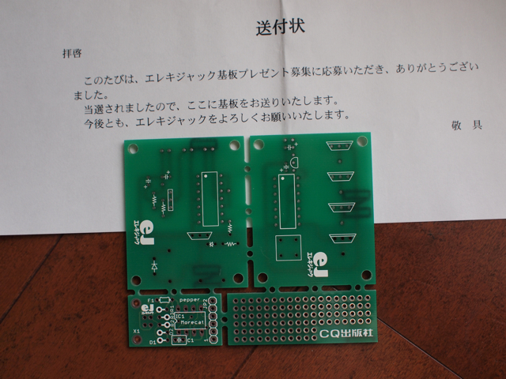

エレキジャックの基板プレゼントにまた当選してしまいました。忘れたころに届いたのでびっくり。  
ただこの基板自体はそんなに難しいパターンではなく、ユニバーサル基板でも十分組める回路なのですが、右下に小さくあるPepperというフィジカルコンピューテイングのプラットホームの基板については興味があるので、パーツをそろえて作ってみたいと思います。  
Pepperの記事は[エレキジャックのページ](http://www.eleki-jack.com/FC/2008/11/post.html)にあるのでそちらをご覧ください。

