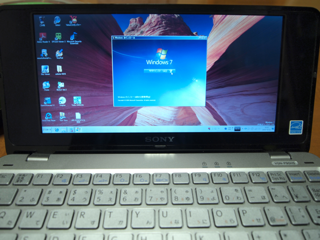

VAIO type PにWIndows 7 Home Premiumをインストールしてみました。  
ベースとなる環境はVAIO type Pに標準でインストールされていたWindows VISTAの上に、「新規インストール」でWindows 7 RCをインストールしたものです。  
今回購入したWindows 7 Home Premiumはアップグレード版なので、Windows 7 RCから一度VISTAにリカバリしなくてはいけないのかなと思ったのですが、とりあえずWindows 7 RCの上で、インストールを行ってみました。  
インストールの際に「アップグレード（上書きインストール）」と「新規インストール（カスタム）」を選ぶのですが、私は新規インストールを選びました。途中でアップグレード元のOSが違うとかいう警告がでることもなく、すんなり最後までインストールできました。  
環境設定はこれからですが、今のところは問題無いようです。インストール直後に９つの更新プログラムがかかったのはびっくりしましたが、安定するためであればそれは良しと思います。  
デバイスマネージャーでは、１つだけ不明なデバイスが残っています。Windows 7 RCの時と同様にVISTAのドライバを入れれば解消するのでしょうが、そのうち[SONYから正式版のドライバが配布](http://vcl.vaio.sony.co.jp/windows/7/upgrade/readme.html)されると思うので、それを待つことにします。

