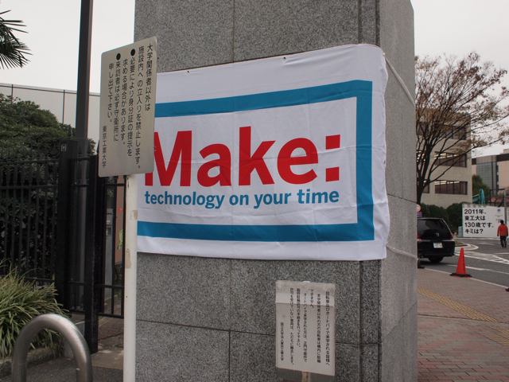

大岡山の東京工業大学でMake: Tokyo Meeting 04が開催されていたので、顔を出してきました。  
面白かったのは、「マッチ棒ロケット」。マッチを２本アルミホイルに包み、周りからアルミホイルを熱することで、燃焼ガスのジェットを作りロケットにするというもの。非常に単純な構造なのですが、再現性が難しくなかなか遠くに飛びませんが、何度か試しているうちに遠くに飛ばすことができました。  
あとは、スイッチサイエンスさんでTwitterの名刺を頂き、いくつかパーツを買いました。オライリーさんでは本とタンブラーを買ったら、カレンダーをいただきました。  
学研さんのブースではこれまでの大人の科学の一覧があり、春にはArduinoが付録になるようです。  
他にも興味深いものがいろいろありましたが、Make: blogでまとめていただけると思いますので。

