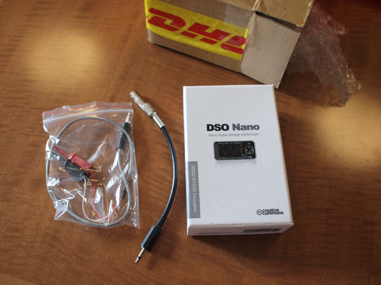
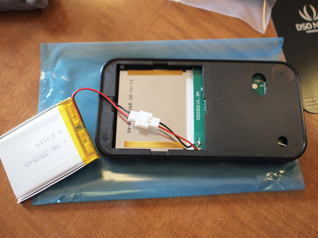
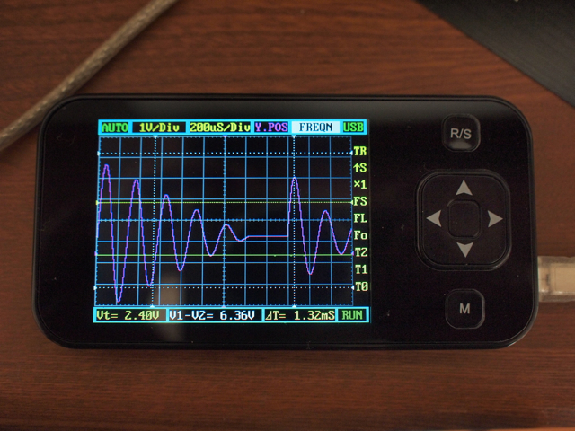
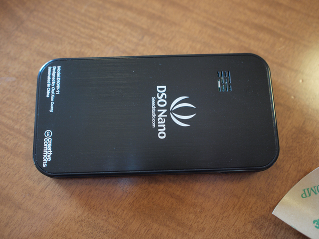

DSO nanoをようやく開封しました。  
到着したパッケージはこんな感じ。カッコいい箱に入っています。一緒に注文した予備のプローブも同封されていました。

中身はこんな感じです。バッテリと裏蓋は自分で貼付けるようです。マニュアルはいたってシンプル。付属のソフトケースは厚みがあり、落としても保護してくれそうです。

まずはバッテリを接続します。適当なUSBケーブルで充電開始です。

横にある電源スイッチをONにすると、バージョン情報が表示されたあとの初期画面になります。実に奇麗です。私のバージョンはV1.1で、Firmwareは2.02でした。

とりあえず、KORG DS-10というソフトウェアシンセの出力を接続してみました。VCOの波形を三角波にして表示してみます。

<figure>

<figcaption>

OLYMPUS DIGITAL CAMERA

</figcaption>

</figure>

  
動作は問題なさそうなので、裏蓋を貼付けることにしました。

両面テープはこんな感じで貼付ければいいのかな？　特にマニュアルにこのあたりの説明はありません。これを使う人はこれくらいできるだろうということでしょう。

  
無事裏蓋の張付けが完了しました。これで持ち運んで使えます。

使ってみての感想ですが、操作性は特に問題ないと思います。ただ、横についている電源スイッチが少し小さいので、この点はいまいち。どれかのボタンを長押しすれば電源がON/OFFになるとかすればいいかなと思いました。  
まだ、SDカードとかPCとの接続等は行っていないのでこれからやってみます。  
このような測定器はどこでも持ち運んで使えるというのが理想かなと思いますが、このDSO nanoは良くできていると思います。
