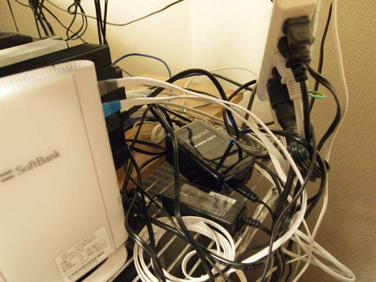

土日にかけてKURO-SHEEVAが秋葉原のショップで販売されているという話を聞き、出かけてきました。

TSUKUMO exやT-ZONEやクレバリーなどで土曜日から売られていたようですが、今日見た限りではすでに売り切れの模様。そういえば少し離れたTSUKUMO 12号館にはないかなと覗いてみたら、KURO-SHEEVAの箱が置いてありました。そのままレジに。

自宅に帰って早速開封です。外観はこんな感じ。

付属品はUSBケーブル、LANケーブル、電源ケーブル、電源プラグ（日本では使用禁止とのこと）、CD-ROMが１枚だけ。  
とりあえず、付属のUSBケーブルでVAIO Type P(WIndows7)に接続し、CD-ROMからUSB-シリアルドライバをインストール。シリアルスピードを調整したらコンソール画面が出てきました。

このあと、rootのパスワードを変更して、固定IPにして、DNSが引けるようにしました。  
最低限のセットアップが完了。我が家のネットワークに組み込まれました。

とりあえず、サーバラックに設置。

とりあえず仮設置完了です。どこにKURO-SHEEVAがあるか分かりますか？  
まだ細かい設定を進めたいのですが、ちょっと風邪気味なので今日はこれまで。
