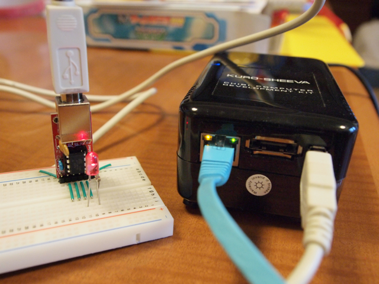

KURO-SHEEVA（玄柴）にGainer互換のPepperを接続してみました。  
参考にしたのはエレキジャックのサポートページです。  
[「Gainer互換Pepperでフィジカル・コンピューティング」フォローアップ記事（6）](http://www.eleki-jack.com/FC/2010/01/gainerpepper6.html)  
すでにKernelは2.6.32.3に更新済で、cdc\_acmドライバは組み込まれているので、PepperをKURO-SHEEVAのUSBに接続すれば認識できるはずです。  
まずは、シリアル通信での動作確認を行うためにuucpパッケージをインストールします。

```
$ sudo apt-get install uucp
```

続いてuucpが使用するグループに登録します。

```
$ sudo usermod -G dialout ユーザ名$ sudo usermod -G uucp ユーザ名$ groups ユーザ名ochanet uucp dialout$
```

ここで、PepperをKURO-SHEEVAに接続してみます。syslogを確認します。

```
$ sudo tail /var/log/messagesMar 20 08:13:40 debian kernel: usb 1-1: new low speed USB device using orion-ehci and address 2Mar 20 08:13:40 debian kernel: usb 1-1: config 1 interface 1 altsetting 0 endpoint 0x1 is Bulk; changing to InterruptMar 20 08:13:40 debian kernel: usb 1-1: config 1 interface 1 altsetting 0 endpoint 0x81 is Bulk; changing to InterruptMar 20 08:13:40 debian kernel: usb 1-1: configuration #1 chosen from 1 choiceMar 20 08:13:40 debian kernel: cdc_acm 1-1:1.0: ttyACM0: USB ACM deviceMar 20 08:13:40 debian kernel: usbcore: registered new interface driver cdc_acmMar 20 08:13:40 debian kernel: cdc_acm: v0.26:USB Abstract Control Model driver for USB modems and ISDN adapters
```

認識されているようです。  
デバイス名はttyACM0とのことなので、パーミッションを確認します。

```
$ ls -l /dev/ttyACM0crw-rw---- 1 root dialout 166, 0 Mar 20 08:13 /dev/ttyACM0$
```

dialoutグループに登録しているので、アクセスできるはずです。

```
$ cu -l /dev/ttyACM0Connected.
```

接続しました。ここで ?\* と入力すると、

```
$ cu -l /dev/ttyACM0Connected.?1.0.0.0,pepper,20090621*
```

こんな感じでバージョン情報が表示されます。cuから抜ける場合は ~. です。  
これで接続確認までは完了しました。  
次にPepperを制御するためにRubyをセットアップします。

```
$ sudo apt-get install ruby $ sudo apt-get install rubygems1.8
```

gainerのパッケージがあるのでしょうか？

```
$ gem search gainer --remote
*** REMOTE GEMS ***
$
```

無いみたいです。  
エレキジャックのページにおいてあるパッケージを持ってきます。

```
$ wget http://www.eleki-jack.com/FC/2009/12/30/gainer-0.0.2.gem$ ls -l total 7-rw-r--r-- 1 ocha ochanet 7168 Dec 30 09:21 gainer-0.0.2.gem$ sudo gem install gainer-0.0.2.gemSuccessfully installed gainer-0.0.21 gem installed
```

シリアルポートを制御するパッケージも持ってきます。

```
$ sudo gem install ruby-serialport
Building native extensions. This could take a while...
ERROR: Error installing ruby-serialport:
ERROR: Failed to build gem native extension.
/usr/bin/ruby1.8 extconf.rb install ruby-serialport
extconf.rb:1:in `require': no such file to load -- mkmf (LoadError)
from extconf.rb:1
Gem files will remain installed in /var/lib/gems/1.8/gems/ruby-serialport-0.7.0 for inspection.
Results logged to /var/lib/gems/1.8/gems/ruby-serialport-0.7.0/ext/gem_make.out
```

mkmfが無いとおこられてしまいました。  
makeをインストールします。

```
$ sudo apt-get install make$
```

もういちどシリアルポートをインストール

```
$ sudo gem install ruby-serialportsudo: unable to resolve host debianBuilding native extensions. This could take a while...Successfully installed ruby-serialport-0.7.01 gem installedInstalling ri documentation for ruby-serialport-0.7.0...Installing RDoc documentation for ruby-serialport-0.7.0...$
```

今度は大丈夫です。確認してみます。

```
$ gem list
*** LOCAL GEMS ***
gainer (0.0.2)
ruby-serialport (0.7.0)
$
```

早速テストプログラムを流してみます。

> $ cat blink.rb  
> require 'rubygems'  
> require 'gainer'
> 
> gainer = Gainer::Serial.new("/dev/ttyACM0")
> 
> flag = true  
> while true  
> 　gainer.analog\_output\[0\] = (flag == true ? 0xff : 0);  
> 　flag = ! flag  
> 　sleep(0.2)  
> end  
> $ ruby blink.rb

Pepperに接続しているLEDが点滅を始めました！  
これで開発環境が整いました。


