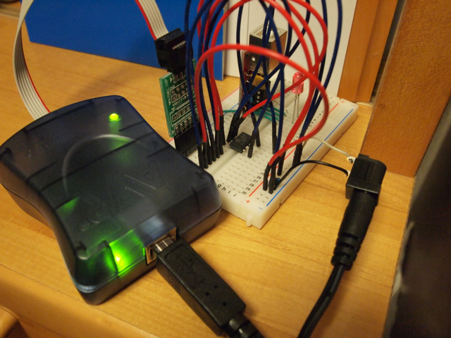
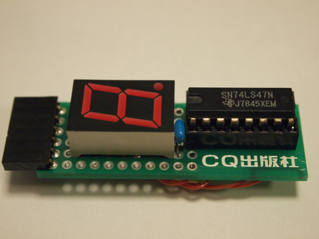
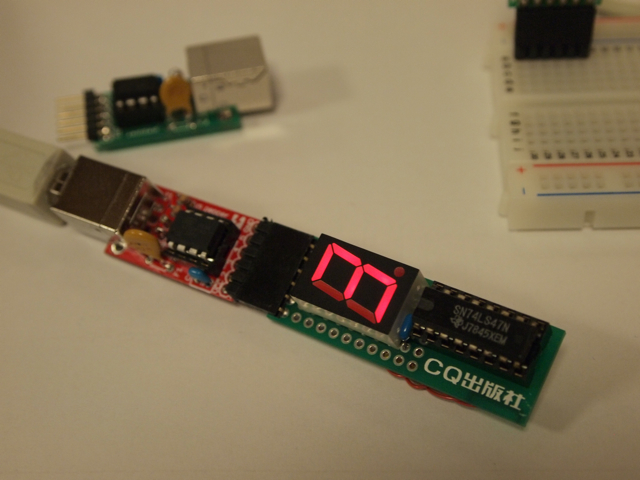

[エレキジャックのサポートページ](http://www.eleki-jack.com/FC/gainerpepper/)に載っているPepperの新ファームウェアを使ってみることにしました。  
まずはAVRマイコン(ATTiny85-20PU)にファームウェアを書き込む準備をしなければなりません。ATMEL純正のプログラマであるAVRISP mkIIを秋月で買ってきて、これをAVRマイコンに接続します。今回は適当にブレッドボードで接続しました。

書き込みソフトは純正のAVR StudioをMacBook ProのParallels DesktopにインストールしているWindows XPにインストールしました。新ファームウェアのHEXファイルはmorecatさんのページからダウンロードして、それをまず書き込み。次にfuse書き込みを行いました。これに失敗すると二度とチップが使えなくなるとのことで、緊張しましたが無事書き込めたようです。

新しいファームウェアが書き込まれたチップを赤いPepperのATTiny85-20PUと交換し、MacBook Proに接続したところ無事動作確認できました。バージョン確認も「?1.0.0.0,pepper,20100221\*」と返ってきたので問題無さそうです。

次にせっかくの新ファームを活用するために、7セグメントLEDを接続してみました。  
普通だとブレッドボードで接続するのですが、今後も使いそうなのでエレキジャックのプレゼント基板の余りを活用して組んでみることにしました。

作成中の基板はこんな感じ。基板スペースが小さいのでチップ抵抗を使いました。

配線が終了しました。あまり美しくないですが勘弁してください。 

表からみるとこんな感じです。

早速Pepperに接続して、MacのProcessingでテストプログラムを実行しました。

配線ミスもなく、無事に数字が表示されました。  
今回はMacからコントロールしましたが、今度は玄柴に接続してrubyから制御してみたいと思います。
