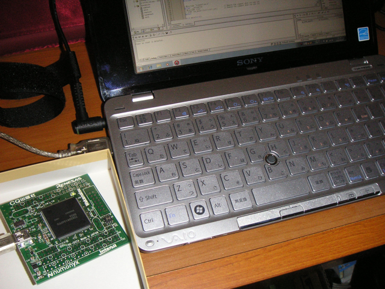

Interface 6月号の付録についていたSH-2A基板を動かしてみました。お決まりのLEDチカチカです。  
開発環境はVAIO type P (Windows7 32bit版)にセットアップすることにしました。  
もしかして今後はんだづけカフェとかにも持ち込むこともあるかもしれないので、MacBook Proよりはこちらがいいかなと。字が小さいのが難点ですが、なんとか読めます。  
開発環境のHEW(High-performance Embedded Workshop)とDeviceFileUpdaterとシリアル接続HEWモニタをインストール後、サンプルプログラムを打ち込んで、ビルド、実行。基板上のLEDがゆっくり点滅し始めました。問題なさそうです。  
とりあえずまだUSBケーブルをつないだだけなので、今後、拡張コネクタを取り付けて、大きめの基板に取り付けていろいろ試してみたいと思います。秋月の300円カラー液晶とかも接続できそうですよね。

高性能32bitマイコンがこんなに気軽に動かせるなんて夢のようです。
