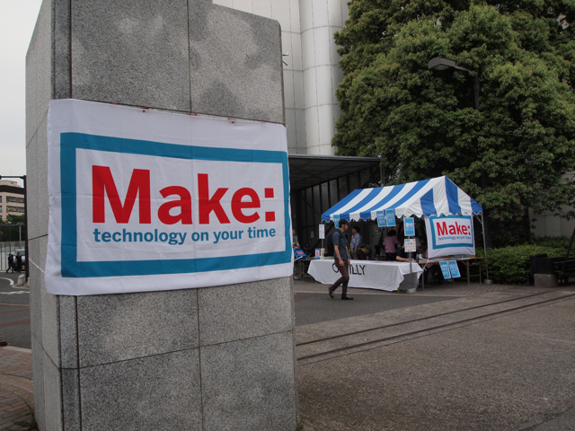

東工大で開催されたMake: Tokyo Meeting 05に出かけてきました。  
時間の都合で体育館しか回れませんでしたが、こどもプログラミングサークルScratch＋Arduinoに参加しました。あとはお目当てのmorecat labさんのGinger-Monakaキットを無事購入できました。  
その後、r-man工房さんのマッチ棒ロケットをたくさん打ち上げさせていただきました。  
他に興味があったのは、超小型飛行体研究所さんの体育館を優雅に飛び回るラジコン飛行機、今井健太郎さんのLEGOのオセロ、KORGの小さなアナログシンセmonotron、今江科学さんのジャイロカー（２輪車がジャイロ１つであんなに安定するとは！）、mbed NXP LPC1768（流行りそう）、まりすさんのブレッドボード用に工夫したパーツの数々、ビー玉マシン、TK-80のキーボードの代わりにフォトカプラを使って16進キーを叩いたと同じようにプログラムを入力して実行しちゃう（しかも、LAN対応）ものとか、ビスマス結晶作成の実演とか。書ききれないですね。  
掘り出し物としてはスイッチサイエンスさんのブースでブレッドボードに使えるジャンパー線が束で100円だったので思わず買ってしまいました。これはお得と思います。  
あとは会場であんなにiPadを見かけるとは。やっぱり1台手元にあったほうがいいのかなぁと思っちゃいました。  
あと、玄柴とかの活用は見かけなかったですね。入手が難しいからかな。

正門はこんな感じ

体育館の外ではこのようなものも。ちゃんとネギを振ってました。

次回も必ず遊びにいきます。
