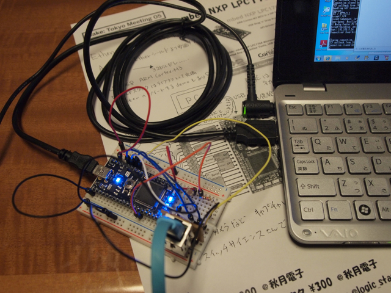

mbedにLANを接続してみました。  
Make: Tokyo Meeting 05で購入したkosakaさんのbreakout基板と秋月のパルストランス付LANコネクタを使用しました。  
このbreakout基板のパターンはかなり細くて、普通のハンダごてでは手強かったので、極細のコテ先に交換してハンダ付けしました。  
配線自体は簡単だったのですが、どうもうまく認識してくれず、数回breakout基板のハンダ付けを確認してなんとか動くようになりました。どこかがブリッジしていたようです。  
mbedサイトにサンプルプログラムがいくつもあり、パケット表示やWebサーバ、Twitterのテストプログラムなど応用できるプログラムが豊富です。  
私の場合は、Webサーバのプログラムをちょっといじってmbedに接続しているCDSの値を表示するようにしてみました。

