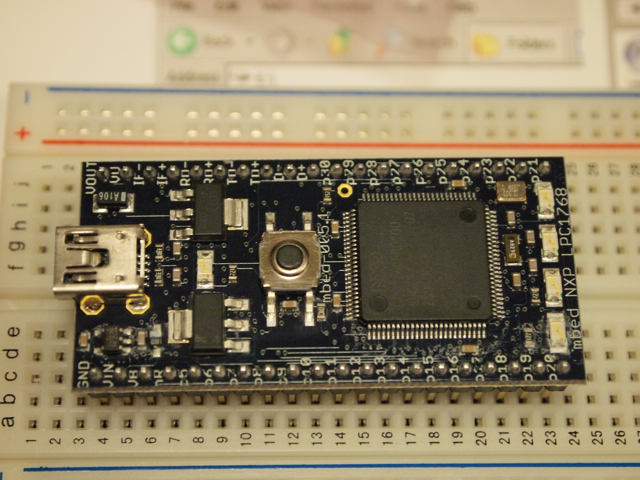
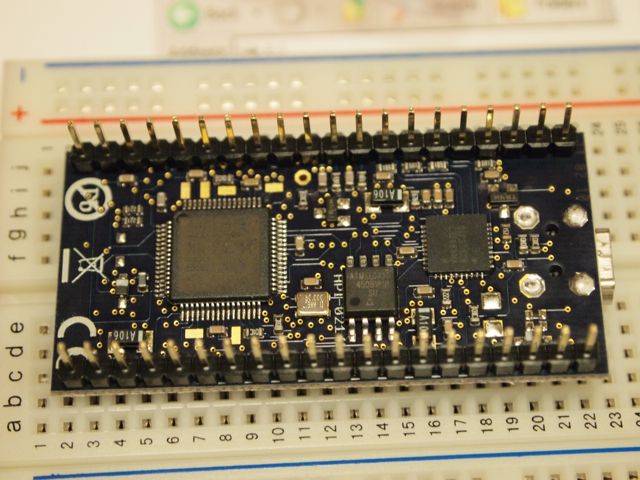

[Make: Tokyo Meeting 05](https://makezine.jp/blog/2010/05/mtm05.html)で「Arduinoはもう古い。時代はmbed！」というパンフレットをもらいました。[http://mbed.org/](http://mbed.org/)をのぞいたところ、なんだか面白そうです。  
LANも直結できる32bitマイコンでブレッドボードで活用できるということで、秋月にオーダーしてしまいました。もちろん、パルストランス付LANコネクタもです。

箱を開けるとこんな感じです。本体とUSBケーブルと簡単な説明の紙。あとはピンレイアウトのカードとmbedのステッカーです。


本体の表面にはLEDが５つも付いています。中央のボタンはリセットスイッチです。



裏面も高密度実装です。



早速VAIO Type PとUSBでつないだところ、自動的にUSBドライブとして認識されました。このドライブの中のMBED.HTMをクリックすると、mbedのWebサイトに飛んでくれます。  
Signupを済ませてクラウドのアカウントを作りました。その後にサンプルプログラムをダウンロードして、このUSBドライブに放り込んで、リセットボタンを押すだけで、サンプルプログラムが動きだしLEDが点滅を開始しました。開発環境の設定がいらないので大変便利です。  
開発環境はクラウドで提供されていて、クラウド上でコンパイルします。コンパイラを起動したら、こんなソースが表示されました。

```
#include "mbed.h"

DigitalOut myled(LED1);

int main() {
  while(1) {
    myled = 1;
    wait(0.2);
    myled = 0;
    wait(0.2);
  }
}
```

見ればわかりますが、LED点滅のプログラムのようです。  
これをコンパイルして、できたバイナリをmbedのUSBドライブにダウンロードしてリセットスイッチを押すと、LED点滅が始まります。  
試しに、wait(0.2)をwait(0.1)と変更すると、点滅速度が早くなります。


LEDが4つ実装されているので、たぶんこんなソースにするとLEDが2つ点灯するかなと改造してみました。

```
#include "mbed.h"

DigitalOut myled1(LED1);
DigitalOut myled2(LED2);

int main() {
  while(1) {
    myled1 = 1;
    myled2 = 1;
    wait(0.5);
    myled1 = 0;
    myled2 = 0;
    wait(0.5);
  }
}

```

予想通りにLEDが2つ同時に点滅を始めました。もう少し改造すれば交互に点灯やナイトライダーぽいことはすぐできそうです。  
mbedサイトにはいろんなサンプルプログラムがあるようですので、今週末はそれを試したあとにLANに接続してみたいと思います。
