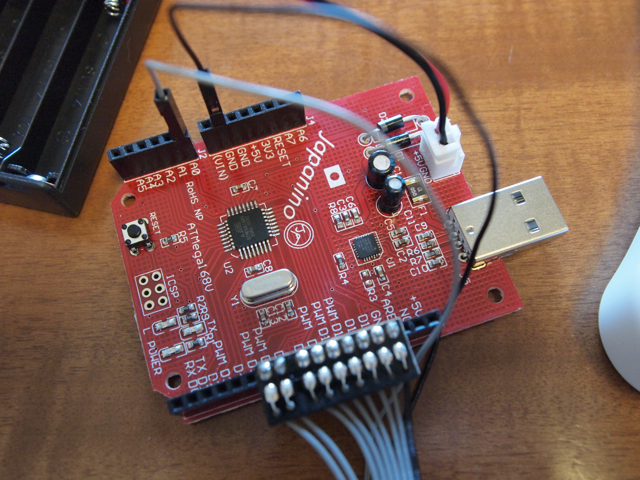

大人の科学マガジン Vol.27 テクノ工作セットを買ってきました。  
Arduino互換のJapaninoとPOVのセットです。  
Japaninoは相当コストをカットしているように見受けられましたが、USBに直接挿すことができるのは便利かも。  
あと、Macで使うときはアップロードのときにタイミング良くリセットスイッチを押さないと行けないのがちと不便です。ファームのアップデートとかでこのあたり改善できるのかなぁ。

