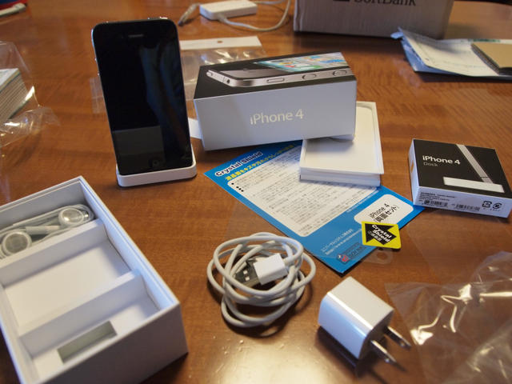
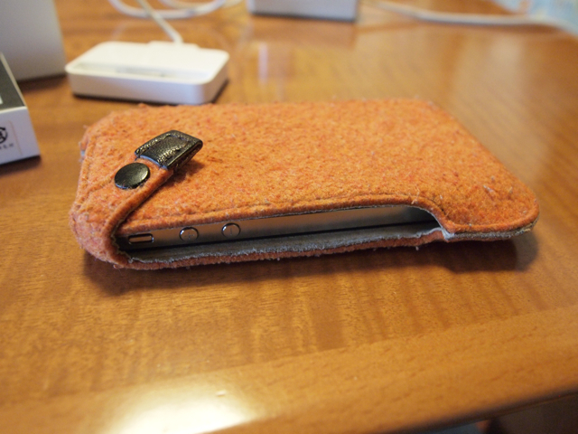

iPhone 4のアクティベーションができるようになるまでに、保護シールを貼っておくことにしました。箱を開けて、保護シートの[Crystal Shield](http://www.pdakobo.com/review/C_Shield/CS_iphone4.htm)を貼り付けました。

貼り付け中は写真を撮っている余裕はないので、その部分は省略。

保護シートのサイズがかなりぴったりに作ってあって、少しでも位置がずれるとシートが浮いてぴったり張り付かないので結構苦労しましたが、埃や空気が入ることもなく貼り付け完了です。  
ただ、前面は問題ないのですが、背面のシートはカメラの周りが浮いてしまいました。レンズの周囲が、完全に平らではないのかもしれません。ぜひ実機でご確認いただければと思います。＞PDA工房さま  
まあ、とりあえずはこのままで使ってみます。  
やはり保護シートを貼るのは埃が落ち着いている早朝がいいですね。

次はケースです。iPhone 3Gで使っていたbuzzhouse designさんの[ハンドメイドフェルトケース](http://www.buzz-house.com/iphone.html)が、iPhone 4でそのまま使えるかという不安があったのですが、buzzhouse designさんに問い合わせたところ、「生地や縫い目が馴染んでいるので、恐らくお使いのケースにiPhone4を入れるとぴったり位かと思います。」という回答通り本当にピッタリでした。慣れているケースがそのまま使い続けられるので良かったです。

<figure>

<figcaption>

OLYMPUS DIGITAL CAMERA

</figcaption>

</figure>

さて、準備は整いました。のんびり充電をしながら、電話機の切り替えができる9時を待つことにします。とりあえず記念写真。

<figure>

<figcaption>

OLYMPUS DIGITAL CAMERA

</figcaption>

</figure>
