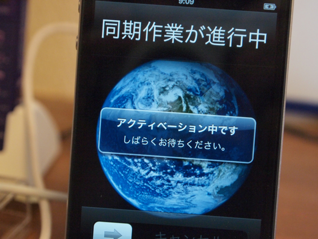

午前9時が近づいたので機種変更に向けてiPhone 3Gの電源を切りました。これまでありがとうiPhone 3G！  
ようやく午前9時になり、機種変更オンライン切替画面で無事機種変更の切り替えを行いました。そうそう、SIMを入れるのを忘れてました。あわてて装着。

このあと、MacBook Proに接続してアクティベーションを開始です。

同期には時間がかかりますね。特に写真の最適化に時間がかかりました。  
無事起動し、3G回線も使えるようになりました。  
ここで、iPhone 3GとiPhone 4で記念撮影。iPhone 3Gは圏外になっています。

第一印象はもともとiPhone 3Gユーザだったので、速くてきれいに尽きると思います。  
あこがれのコンパスもちゃんと動きます。（あたりまえだけど）  
最初にダウンロードしたiBookについてきたプーさんの本はきれい。フォントは本当に美しいです。  
高速になったところ、フォルダを使ってアプリケーションを整理しました。この際使用頻度が低いものは思い切って削除しちゃいました。

あと、気になる点としては、iPhone 4 DockにiPhone 4本体をセットしたままボタンを押そうとするとボタンの端が微妙にDockの縁に隠れて押しにくいです。写真では分かりにくいですが、このDockの縁は少し厚めの幅があるのです。3GのDockは全面が全部見えていて使いやすかったのに。この点は残念。

左がiPhone 3GのDock、右がiPhone 4のDockです。iPhone 4のボタンがDockの縁にかかりそうなのが分かります。iPhone 3GのDockは全面が隠れること無く見えています。やはり操作性はこちらが良いでしょう。
