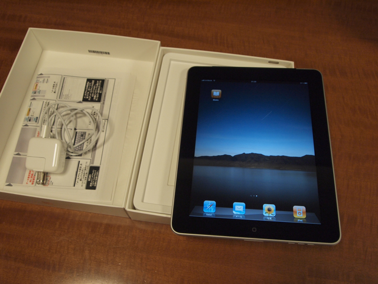

iPadを買ってしまいました。Wi-Fi + 3G 16GBモデルです。

まずは箱から取り出しましたが、思いのほか重い感じがします。  
考えたあげく液晶の保護シートはつけないことにしました。これほど広い保護シートを貼るのは面倒だし、シート自体の価格もやや高いです。どうせ持ち運びにケースを購入することになるのでそれで保護してくれるかなと割り切りました。  
私はiPhoneを使っているので、基本的な操作方法はわかっているのですが、本当に初めての人にはちとつらいかもという感じがします。  
キーボードは思ったよりは打ちやすいです。表示されるキーの間隔に余裕があるので、iPhoneに比べるとかなり良いです。  
とりあえず、Mac Book Proに接続して同期しましたが、充電はされないのですね。相当電流が流れているようなので、旅行の時は専用ACアダプタの携帯が必須です。  
すでに、iPhone4でiOS4を使っているからですが、iPadも早くiOS4にしてほしいですね。使っているアプリが多いので、フォルダで整理したいところです。  
まだケースを購入しておらず、外に持ち出していないので3Gの性能はまだ未知数ですが、この夏休みに田舎に持って帰る予定なので、そこで評価することにしましょう。  
今は携帯PCとしてはVAIO type pを使っているのですが、小さい文字がこれから厳しくなると思うので今後はiPadがメインになるかもしれないです。  
iPad完全対応アプリがまだ少ないのは残念。2倍表示モードは表示がギザギザになるので余り使う気がしないです。それならiPhoneで使えば事足りるような。でも、対応アプリはなかなか良い感じです。  
第一印象はこんな感じです。あとは持ち運んでみたいと思います。ケースどうしようかな。
