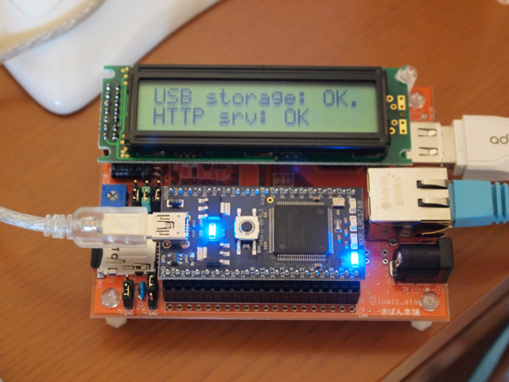

mbedのベースボードとして[☆board orange](http://mbed.org/users/lofic_star/notebook/star_board_orange/)が発売予定ですが、少し早めに基板をいただくことができましたので組み立ててみました。  
集めてきたパーツはこんな感じです。

表面実装のパーツとしてはmicroSDカードスロットがありますが、位置を正確に合わせた後に先の細い半田ごてでハンダをちょこっと流し込むことで簡単にハンダ付けできます。特殊なパーツはありませんので、秋月で揃えることができます。  
組み立て後はこんな感じ。

このようにLCD, microSDカード, USBホスト, LANと主なI/Oが揃っているので、これ一つで考えついたことが気軽に試せそうです。
