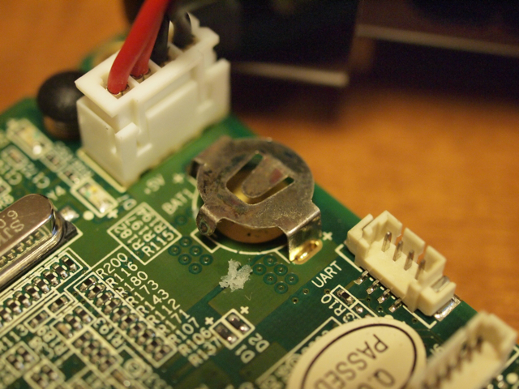
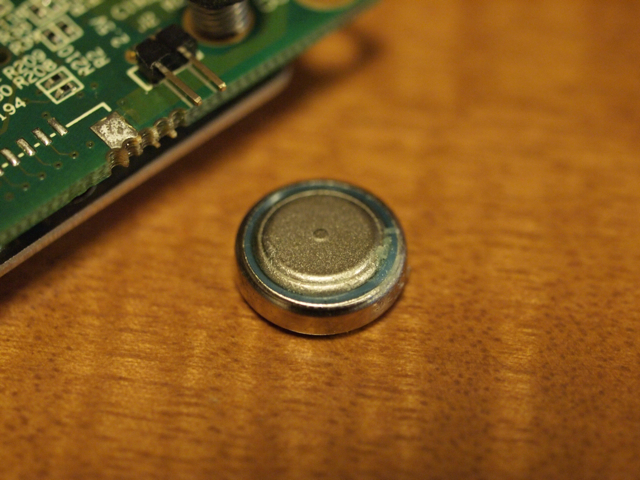
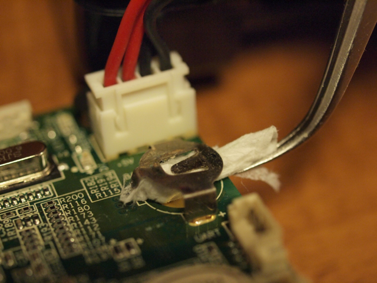

久しぶりに玄柴にログインしようとしたら無反応になっていました。リセットスイッチを押したり電源コンセントを抜き差ししても変化なし。コンソールをUSBに接続しても、PCでUSBを認識しない状態になっていました。LEDは青いLEDが消灯しています。普通は点灯するはずですが。  
ふたを開けたところ、基板の上に実装されているボタン電池(AG10)が液漏れしていました。

とりあえず、ピンセットで液漏れした固形物を取り除き、ティッシュと綿棒で端子を掃除しました。

新しい電池(LR1130)を買ってきて取り付けてみたものの変化なし。

とにかくUSBデバイスとして全く認識してくれないので厳しい状態です。  
青いLEDが点灯しないのはどういう状態なのでしょう。ドキュメントを探してみたいと思います。
