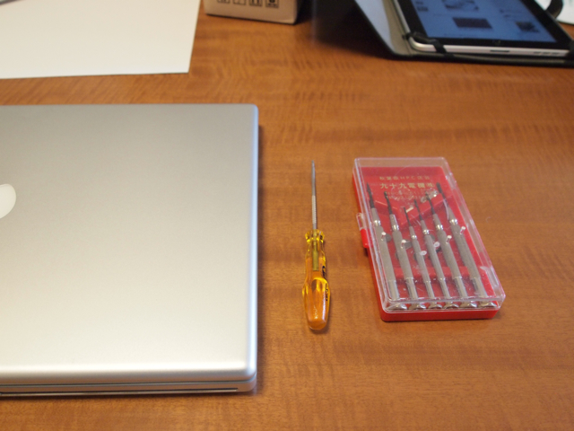
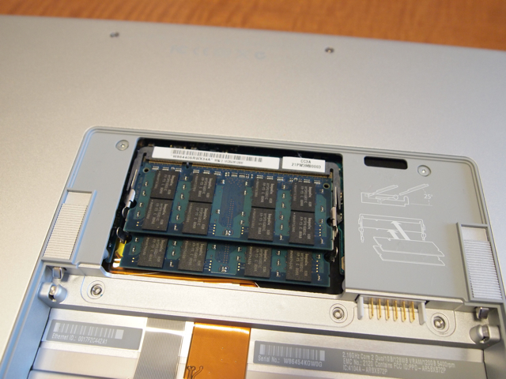
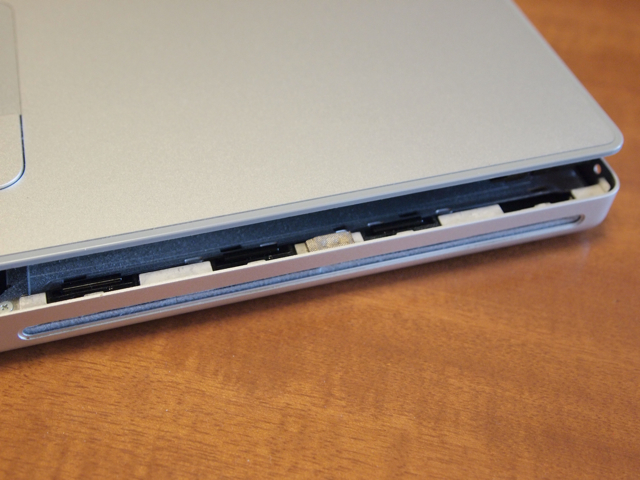
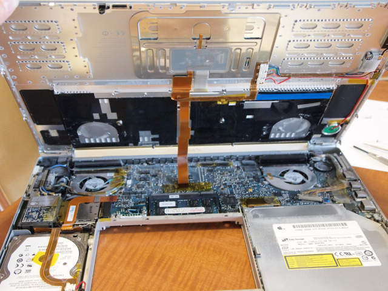
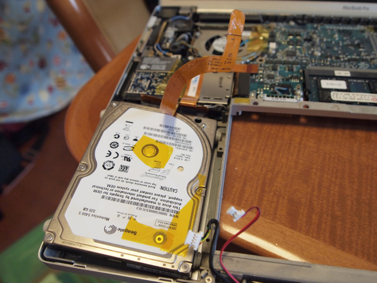
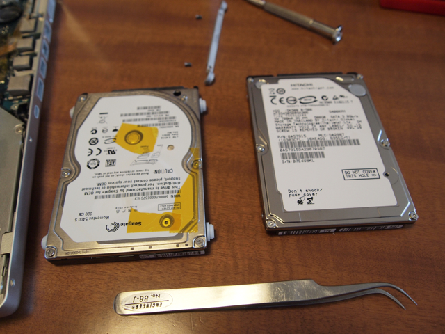
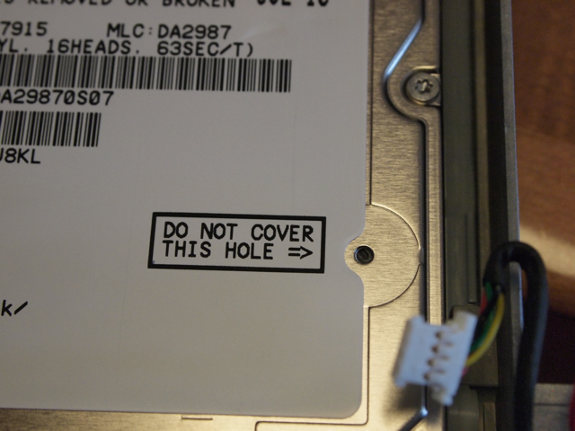

MacBook Pro(15-inch Core 2 Duo 機種ID:MacBookPro2,2)のハードディスクのコピーが終わりましたので、ハードディスクとDVDの交換を行いました。  
※この記事のようにふたを開けると当然メーカー保証もなくなります。自己責任でお願いします。  
前回ハードディスクの交換を行ったので、およその方法は分かっていますが、DVDの交換は初めてになります。参考としたWebサイトは以下の通りです。

- [MacBook Pro 1.83GHz/2.0GHz(2006年1月発表、15インチモデル)](http://ascii.jp/elem/000/000/352/352409/)

- [MacBook Proのハードディスク交換完了 - きょうのかんぱぱ](https://kanpapa.com/2008/09/macbook-pro-1.html)

用意した工具は精密ドライバーのセットとT6のトルクスドライバーです。これ以外に先の細いピンセットが必要になります。

バッテリを外します。

メモリスロットのカバーを外します。

他のネジを外します。外したネジはいつものように図に書いて並べます。

ここが一番苦労するところなのですが、トラックパッドの後ろ側を押しながら、内部のツメを無理矢理外します。うまく外れて一安心。

ふたを持ち上げるとロジックボードが見えます。

前回ふたを開けたのが2008年ですから2年程度経過しています。やはりファンの周りに埃が溜まっています。

今回はロジックボードの上にも埃が溜まっています。とりあえずブロアーでできる範囲で吹き飛ばします。

お掃除が完了したところで、ハードディスクを外します。

旧(320GB)、新(500GB)のハードディスクです。

新しいハードディスクを取り付けます。

ハードディスクの上を見ると、「DO NOT COVER THIS HOLE」の文字が。

このままだとちょうどこの穴を塞ぐようにフラットケーブルが来てしまいます。  
さて困ったといろいろ試しましたが、結局斜めにフラットケーブルを貼付けることにしました。あまり曲げるとストレスになってしまうので、ぎりぎり穴を塞がないようにしました。今度交換するときはちゃんと穴の位置も確認することにします。

これでハードディスクの交換はおしまい。次はDVDの交換に入ります。
