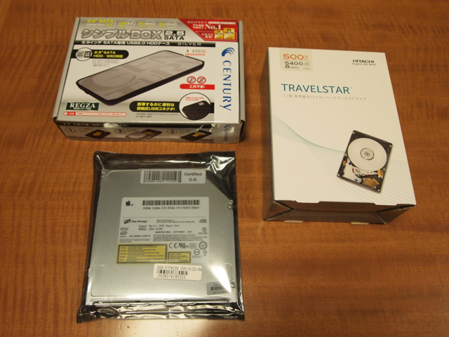
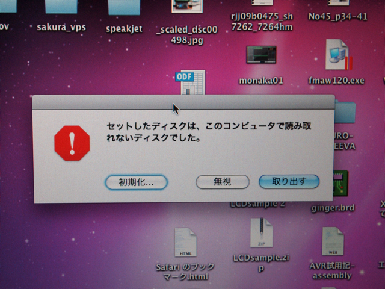
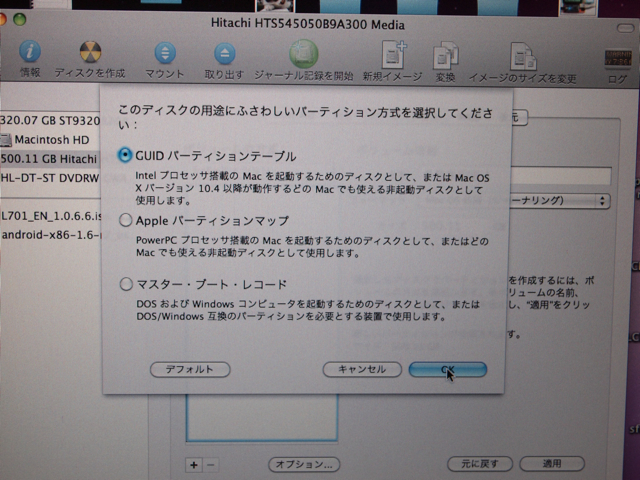
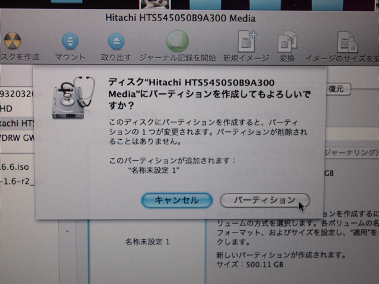
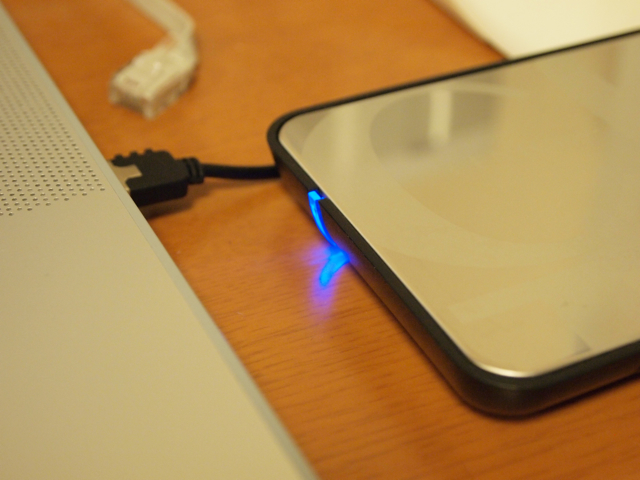
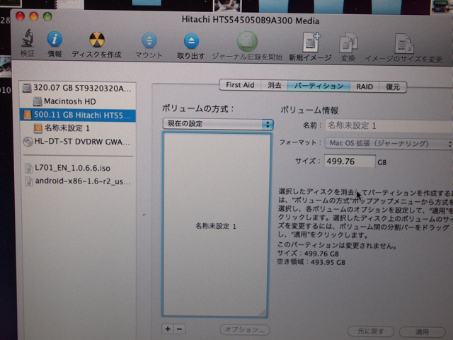

MacBook Pro(15-inch Core 2 Duo 機種ID:MacBookPro2,2)の内蔵DVDドライブが壊れてしまいました。ディスクをいれようとしても何かが引っかかっていて奥に入りません。これは困ったということで、内蔵DVDドライブの交換を行うことにしたのですが、どうせMacBook Proのふたを開けるのであれば、ついでにハードディスクも容量を大きくすることにしました。現在320GBですが、最近では500GBが4000円台ということでお手頃になっているようです。  
早速秋葉原で以下の材料を集めました。

- 2.5インチ 500GB S-ATA HDD（発熱を考え5400rpm）

- 2.5インチ S-ATA HDD用外付けケース(USB接続用)

- MacBook Pro用DVDドライブ

集めたものはこんな感じです。

そして、MacBook Proに接続します。

ここで初期化のボタンを押すと、ディスクユーティリティの画面になります。ここで新しいパーティションを作成しますが、念のためオプションボタンを押して、GUIDパーティションテーブルになっているかを確認します。

その後１パーティションを作成します。ボリューム名はあとで上書きされますのでそのままで問題ありません。

適用ボタンを押します。

パーティションボタンを押すと、ディスクアクセスが始まります。

パーティションが作成できました。「名称未設定１」というボリュームができています。

次は復元を行います。ソースは起動ドライブ、復元先はUSB接続した新しいハードディスクです。

あとは完了までひたすら待ちます。この間は何も操作しないほうがいいでしょう。私の場合はネットワークも全部切断して復元を行いました。  
これでハードディスク交換の前準備は完了です。
